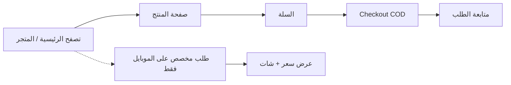

# Zezo Store — دليل العميل (موبايل + موقع)

**Zezo Store** متجر إلكتروني للبيع بالتجزئة (عطور، ساعات، إكسسوارات، ملابس). العميل يتصفح الكتالوج، يضيف للسلة، يدفع **عند الاستلام (COD)**، ويتابع حالة الطلب.

فيه قناتين للعميل:

| القناة | أين | الجمهور |
|---|---|---|
| تطبيق الموبايل | iOS / Android | التجربة الكاملة |
| الموقع | `http://localhost:5173` | تسوق سريع من المتصفح |

اللغة عربي / إنجليزي (RTL)، والهوية كحلي `#071345` وأبيض.

---

## التطبيق بيعمل إيه

العميل يقدر:

1. يتصفح التصنيفات والمنتجات (مميز، وصل حديثًا، الأكثر مبيعًا، عروض).
2. يفتح صفحة المنتج، يشوف الصور والسعر والمخزون، ويضيف للسلة أو للمفضلة.
3. يعمل checkout بعنوان توصيل، والدفع **كاش عند الاستلام**.
4. يتابع الطلب من قيد الانتظار → مقبول → تجهيز → جاهز → خرج للتوصيل → تم التوصيل → مكتمل، ويقدر يلغي وهو لسه pending.
5. على **الموبايل فقط**: يبعت **طلب مخصص** (مقاس، لون، صور، تفاصيل)، يشوف عرض السعر، يتكلم مع الدعم، ويأكد أو يرفض العرض.

الزيارة بدون حساب متاحة للتصفح. السلة والمفضلة والطلبات والـ checkout محتاجين تسجيل دخول.

---

## الموبايل — التابات

بعد الـ splash / onboarding، الشاشة الرئيسية فيها **5 تابات** في الـ bottom bar:

```
الرئيسية   التصنيفات   المفضلة   الطلبات   حسابي
```

### 1. الرئيسية (`home`)

أول شاشة بعد الدخول.

- شعار Zezo Store، أيقونة السلة، وأيقونة الإشعارات.
- بحث عن المنتجات.
- بانرات إعلانية من لوحة التحكم.
- شريط تصنيفات.
- زر **طلب مخصص**.
- صفوف منتجات: مميز، وصل حديثًا، الأكثر مبيعًا.

من هنا العميل يفتح المنتج، السلة، الإشعارات، أو فورم الطلب المخصص.

### 2. التصنيفات (`categories`)

قائمة كل الأقسام (عطور، ساعات، إكسسوارات، ملابس، …). الضغط على تصنيف يفتح شبكة منتجات هذا القسم.

### 3. المفضلة (`favorites`)

المنتجات اللي العميل ضغط عليها القلب. الضيف يتطلب منه تسجيل الدخول. إزالة المنتج من المفضلة تتم من نفس القلب.

### 4. الطلبات (`orders`)

طلبات الشراء العادية (مش الطلب المخصص). كل صف يعرض رقم مختصر والحالة. الضغط يفتح **تفاصيل الطلب**: timeline أفقي للحالة، الإجمالي، طريقة الدفع، العنوان، العناصر، وزر إلغاء لو الطلب لسه pending.

### 5. حسابي (`profile`)

- للضيف: ترحيب + تسجيل دخول / إنشاء حساب.
- للمسجّل: الاسم والإيميل، طلباتي، طلب مخصص، الإشعارات، تسجيل خروج.
- للجميع: اللغة (عربي / English) والثيم (فاتح / داكن / حسب النظام).

---

## الموبايل — شاشات خارج التابات

دي مش تابات، بتتنقل ليها من الأيقونات أو من داخل الصفحات:

| الشاشة | الوظيفة |
|---|---|
| تسجيل الدخول / إنشاء حساب / نسيت كلمة المرور | الحساب |
| تفاصيل المنتج | صور، سعر، مقاس إن وجد، أضف للسلة، أضف للمفضلة |
| كل المنتجات / البحث | شبكة منتجات مع فلاتر (تصنيف، مميز، بحث) |
| السلة | الكميات، الحذف، الذهاب للدفع |
| إتمام الطلب | الاسم، الهاتف، المدينة، الشارع، ملاحظات، تأكيد COD |
| الإشعارات | رسائل التطبيق |
| طلب مخصص | اختيار تصنيف، وصف، حقول (جنس، مقاس، لون…)، صور، إرسال |
| تفاصيل الطلب المخصص | حالة الطلب، العروض، تأكيد/رفض العرض |
| الشات | محادثة مع الدعم على الطلب المخصص |

---

## الموقع — التبويبات والقوائم

الموقع أبسط من الموبايل: هيدر ثابت في كل الصفحات، بدون bottom tabs.

### الهيدر (في كل الصفحات)

من اليمين لليسار في العربي (والعكس في الإنجليزي):

| عنصر | الوظيفة |
|---|---|
| شعار **Zezo Store** | الرجوع للرئيسية |
| البحث | يفتح صفحة المتجر بنتائج البحث |
| المتجر | كل المنتجات |
| السلة | محتويات السلة + العدد |
| تسجيل الدخول / طلباتي + خروج | حسب حالة الحساب |
| ع / EN | تبديل اللغة |

### الصفحات

| الصفحة | المسار | ماذا تعمل |
|---|---|---|
| الرئيسية | `#/` | هيرو (بانر)، تصنيفات، مميز، وصل حديثًا، الأكثر مبيعًا |
| المتجر | `#/shop` | كل المنتجات، مع فلتر تصنيف أو بحث أو featured |
| المنتج | `#/product/:id` | صورة، سعر، وصف، أضف للسلة (بعد الدخول) |
| السلة | `#/cart` | العناصر، الإجمالي، إتمام الطلب |
| تسجيل الدخول | `#/login` | إيميل وكلمة مرور |
| إنشاء حساب | `#/register` | اسم، إيميل، كلمة مرور، هاتف |
| إتمام الطلب | `#/checkout` | عنوان التوصيل + تأكيد COD |
| طلباتي | `#/orders` | قائمة الطلبات برقم مختصر والحالة والإجمالي |

---

## مقارنة سريعة: موبايل vs موقع

| الميزة | الموبايل | الموقع |
|---|---|---|
| تصفح الكتالوج والتصنيفات | نعم | نعم |
| سلة + COD | نعم | نعم |
| متابعة طلبات الشراء | نعم (تاب + تفاصيل + timeline) | نعم (قائمة فقط) |
| مفضلة | نعم (تاب) | لا |
| طلب مخصص + شات + عروض | نعم | لا |
| إشعارات داخل التطبيق | نعم | لا |
| ثيم فاتح/داكن | نعم | لا (ثيم كحلي ثابت) |
| عربي / إنجليزي | نعم | نعم |
| تصفح كضيف | نعم | نعم |

الخلاصة: **الموقع للتسوق السريع**. **الموبايل للمنتج كامل** بما فيه الطلبات المخصصة والمفضلة والإشعارات.

---

## رحلة العميل المختصرة



1. يتصفح بدون حساب.
2. يسجّل دخول عند الإضافة للسلة أو المفضلة أو الطلب.
3. يدفع عند الاستلام.
4. لو محتاج قطعة مش موجودة جاهزة: من الموبايل يبعت طلب مخصص ويتابع العرض من التاب أو من حسابي.
